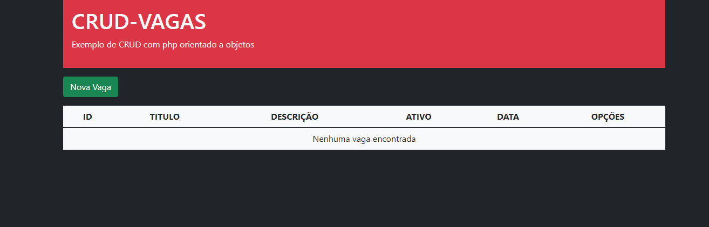

  <a href="#-tecnologias">Tecnologias</a>&nbsp;&nbsp;&nbsp;|&nbsp;&nbsp;&nbsp;
  <a href="#-projeto">Projeto</a>&nbsp;&nbsp;&nbsp;|&nbsp;&nbsp;&nbsp;

 

  

## 💻 Tecnologias

Este CRUD foi desenvolvidos nas tecnologias:

- HTML
- PHP
- Mysql

framework Frontend
 - Boostrap

## 📐 Projeto

Esse crud desenvolvido tem como finalidade aperfeiçoar os fundamentos de orientação a objetos na linguagem PHP.